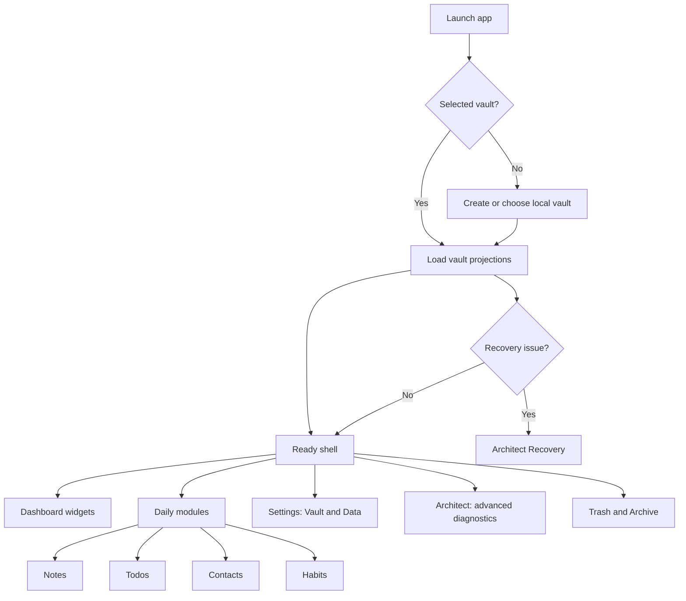

# App Behavior Diagram

## Ownership Rules

- Daily work belongs in Dashboard and module surfaces.
- Settings stays calm and configuration-focused.
- Architect owns advanced diagnostics, schema/data graph, recovery, widgets, and appearance.
- Recovery is for app metadata problems, not normal Markdown syntax.
