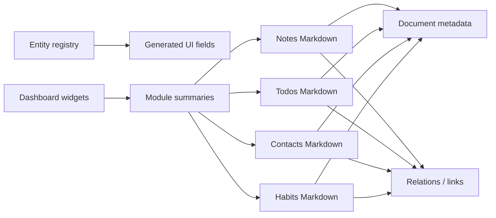

# Entity Relationship Diagram

```mermaid
flowchart LR
  Notes["Notes Markdown"] --> Metadata["Document metadata"]
  Todos["Todos Markdown"] --> Metadata
  Contacts["Contacts Markdown"] --> Metadata
  Habits["Habits Markdown"] --> Metadata
  Entities["Entity registry"] --> Generated["Generated UI fields"]
  Notes --> Relations["Relations / links"]
  Todos --> Relations
  Contacts --> Relations
  Habits --> Relations
  Widgets["Dashboard widgets"] --> Summaries["Module summaries"]
  Summaries --> Notes
  Summaries --> Todos
  Summaries --> Contacts
  Summaries --> Habits
```

Markdown content owns user meaning. Metadata, generated fields, and widgets are supporting projections.
