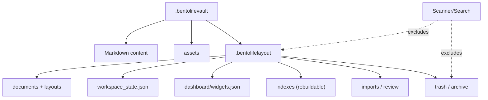

# Vault and Metadata Model

```mermaid
flowchart TD
  Vault[".bentolifevault"] --> Content["Markdown content"]
  Vault --> Assets["assets"]
  Vault --> Layout[".bentolifelayout"]
  Layout --> Documents["documents + layouts"]
  Layout --> Workspace["workspace_state.json"]
  Layout --> Widgets["dashboard/widgets.json"]
  Layout --> Indexes["indexes (rebuildable)"]
  Layout --> Imports["imports / review"]
  Layout --> Lifecycle["trash / archive"]
  Scanner["Scanner/Search"] -. excludes .-> Layout
  Scanner -. excludes .-> Lifecycle
```

The control plane supports the Markdown content layer; it does not replace it.
