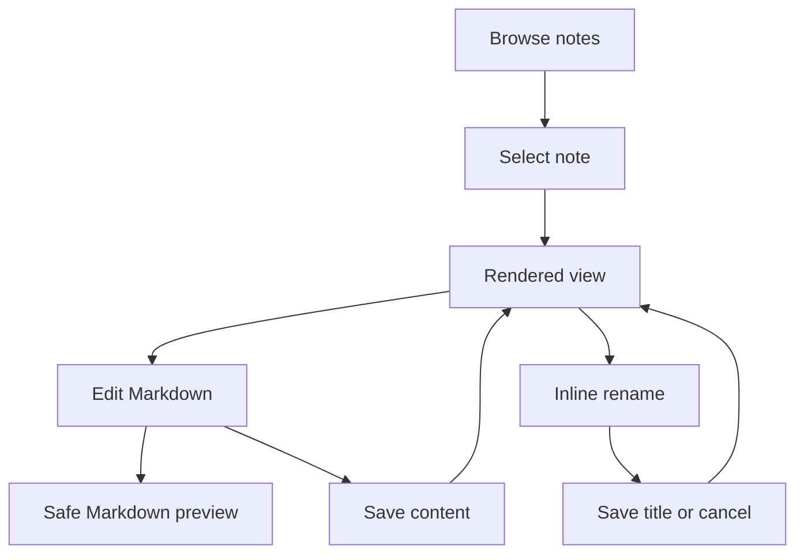
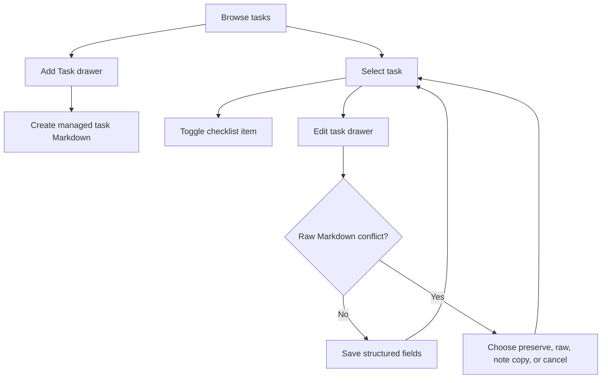
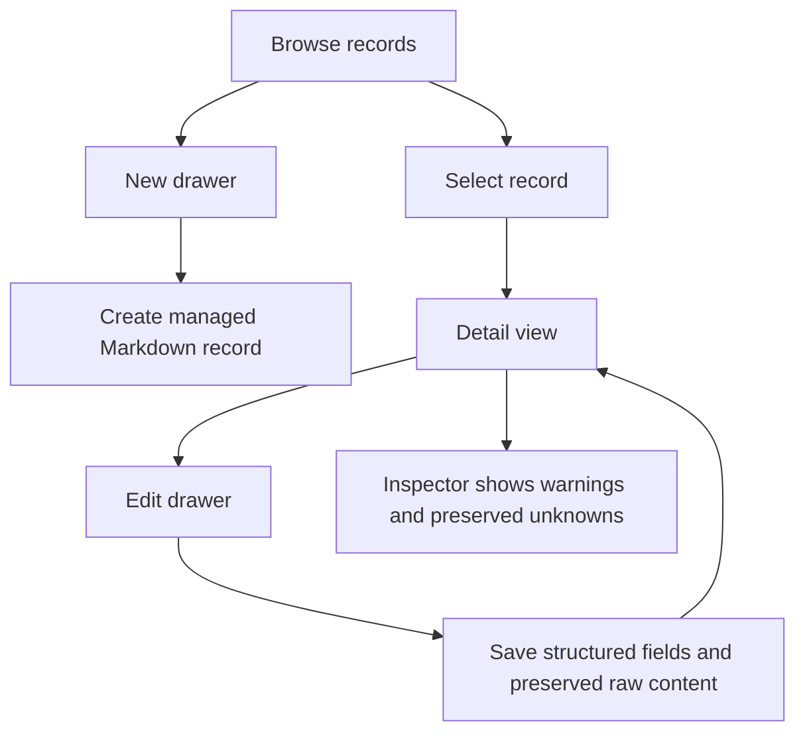

# Module Behavior Diagrams

## Notes

## Todos

## Contacts And Habits

## Shared Module Contract

- Markdown remains the durable user-content source of truth.
- Structured fields are conveniences over managed Markdown.
- Unknown safe content is preserved and surfaced through Inspector/fallback UI.
