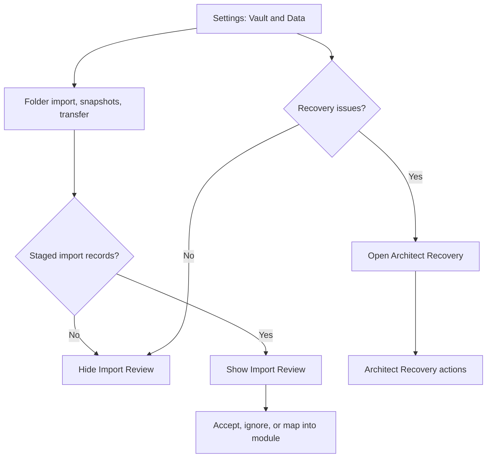
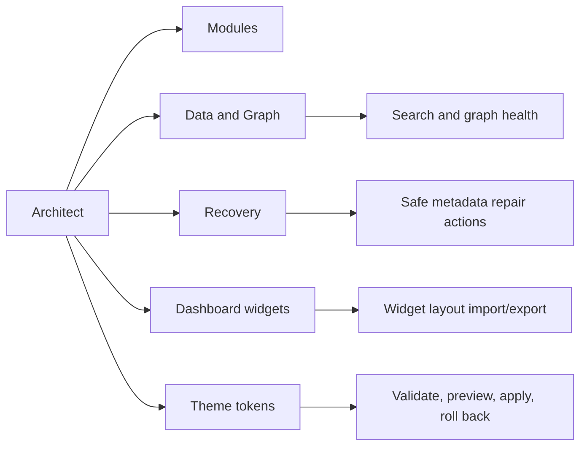
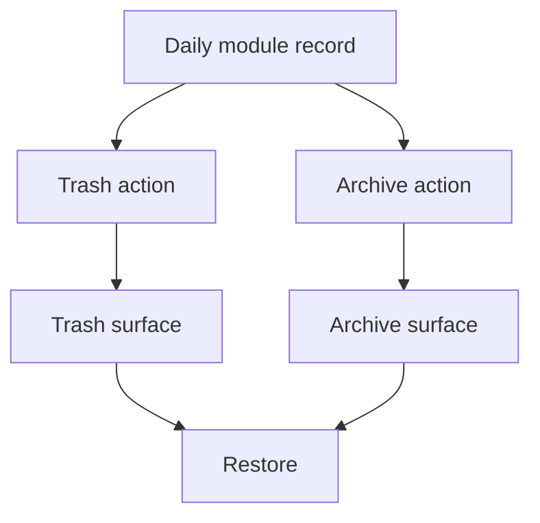
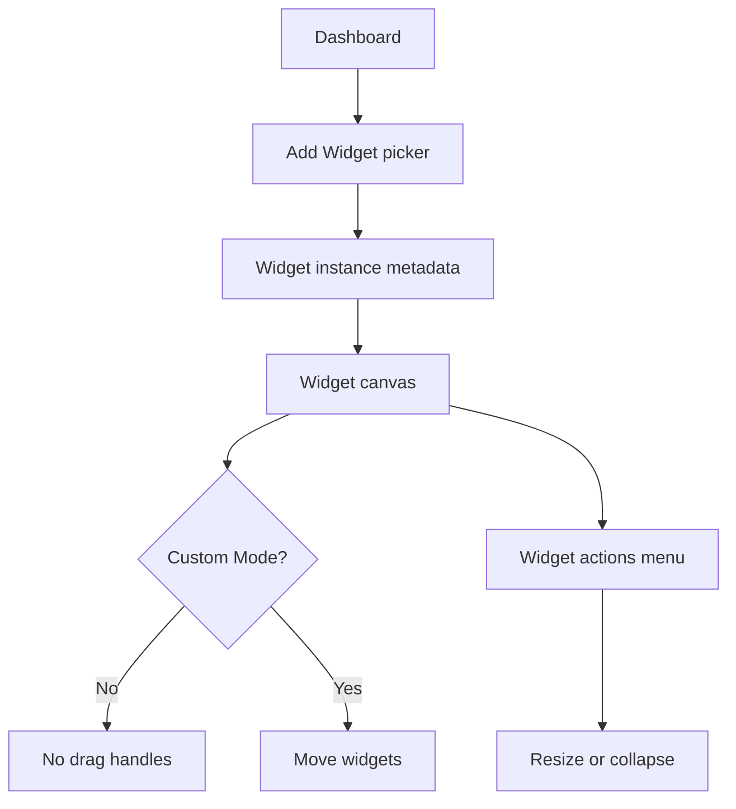

# System Surface Diagrams

## Settings, Import, And Recovery Ownership

```mermaid
flowchart TD
  Settings["Settings: Vault and Data"] --> ImportTools["Folder import, snapshots, transfer"]
  ImportTools --> Staged{"Staged import records?"}
  Staged -->|No| Calm["Hide Import Review"]
  Staged -->|Yes| Review["Show Import Review"]
  Settings --> Issues{"Recovery issues?"}
  Issues -->|No| Calm
  Issues -->|Yes| CTA["Open Architect Recovery"]
  CTA --> Recovery["Architect Recovery actions"]
  Review --> Accept["Accept, ignore, or map into module"]
```

## Architect System Surfaces

```mermaid
flowchart LR
  Architect["Architect"] --> Modules["Modules"]
  Architect --> Graph["Data and Graph"]
  Architect --> Recovery["Recovery"]
  Architect --> Dashboard["Dashboard widgets"]
  Architect --> Appearance["Theme tokens"]
  Graph --> Search["Search and graph health"]
  Recovery --> Repair["Safe metadata repair actions"]
  Dashboard --> Layout["Widget layout import/export"]
  Appearance --> Tokens["Validate, preview, apply, roll back"]
```

## Trash And Archive

```mermaid
flowchart TD
  Module["Daily module record"] --> Archive["Archive action"]
  Module --> Trash["Trash action"]
  Archive --> Archived["Archive surface"]
  Trash --> Deleted["Trash surface"]
  Deleted --> Restore["Restore"]
  Archived --> Restore
```

## Widget System

```mermaid
flowchart TD
  Dashboard["Dashboard"] --> Picker["Add Widget picker"]
  Picker --> Instance["Widget instance metadata"]
  Instance --> Canvas["Widget canvas"]
  Canvas --> Custom{"Custom Mode?"}
  Custom -->|No| ReadOnly["No drag handles"]
  Custom -->|Yes| Move["Move widgets"]
  Canvas --> Menu["Widget actions menu"]
  Menu --> Resize["Resize or collapse"]
```
